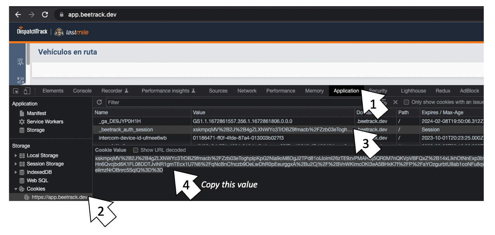

# Directions Agnostic Localhost Proxy
Proxy for directions agnostic for local environment

This proxy allows you to use Directions Agnostic SRM service in local environments

Requirements
- Install Directions Agnostic using the branch `localhost-proxy` in your project

```
npm install @beetrack/directions-agnostic@github:Beetrack/directions-agnostic#localhost-proxy
```

- Clone this repo

- Install all dependencies of this repo 

```
npm install
```

- Go to https://app.beetrack.dev and log in with any account

- Open navigator console and copy the value of `document.cookie` to get the session information



- Paste `document.cookie` value in `proxy.js` file in the `PASTE YOUR app.beetrack.dev COOKIE HERE` part

- Execute this proxy

```
node proxy.js
```

- Now request to Directions Agnostic will be resolved by this proxy and send to `srm.beetrack.dev` with a development credentials and you can do test in your localhost environment