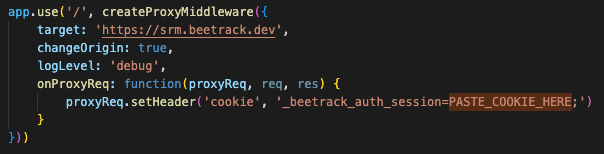

# Directions Agnostic Localhost Proxy
Proxy for directions agnostic for local environment

This proxy allows you to use Directions Agnostic SRM service in local environments

Requirements
- Install Directions Agnostic using the branch `localhost-proxy` in your project

```
npm install @beetrack/directions-agnostic@github:Beetrack/directions-agnostic#localhost-proxy
```

- Clone this repo

- Install all dependencies of this repo 

```
npm install
```

- Go to https://app.beetrack.dev and log in with any account

- Open navigator inspect tools and looking for beetrack auth cookie. In Google Chrome, follow the numbers.


- Paste cookie value in `proxy.js` file in the `PASTE_COOKIE_HERE` part. Don't delete the final `;`.



- Execute this proxy

```
node proxy.js
```

- Now request to Directions Agnostic will be resolved by this proxy and send to `srm.beetrack.dev` with a development credentials and you can do test in your localhost environment